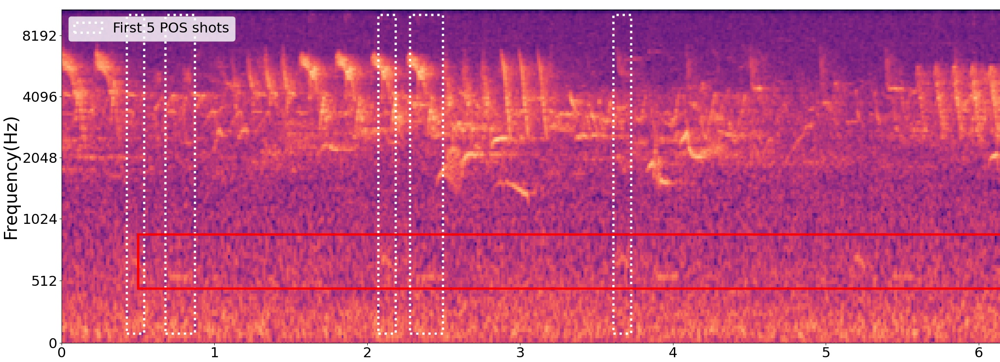
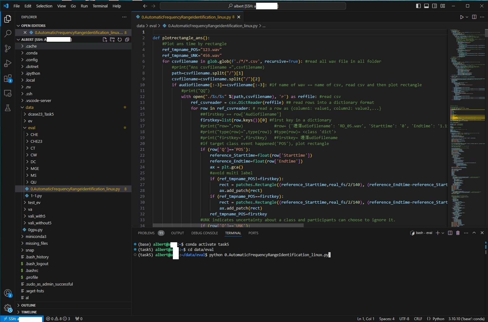
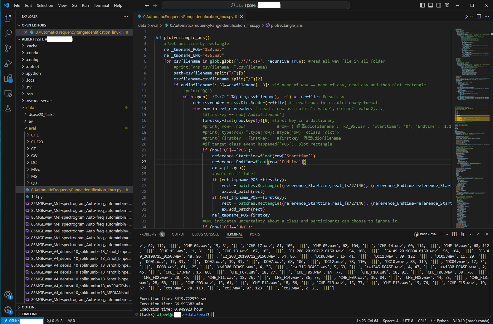

# Automatic Frequency Range Identification (AFRI) in Mel-Spectrograms
Authors: Sheng-Lun Kao, Yi-Wen Liu
---

We devised an algorithm for automatic frequency range identification (AFRI), which determines the frequency range of first 5 positive (POS) events within the mel-spectrogram.
Through the use of AFRI, our system ranked 3rd in the 2024 DCASE Challenge Task 5.


Mel-spectrogram of DC04.wav. The red lines indicate the boundaries of the desired frequency range as determined by AFRI.

---

### How to run code

**Path setting**  
./0.AutomaticFrequencyRangeIdentification_linux.py  
./CHE  
./CHE23  
./CT  
./CW  
./DC  
./MGE  
./MS  
./QU  

**Code execution**

1. Change directory to the path of code

```bash
cd path/to/your/code
```

2. Run the code

```bash
python 0.AutomaticFrequencyRangeIdentification_linux.py
```

Below are examples of the code execution.



### Results of AFRI on DCASE Audio Data
Results of AFRI on the 2024 evaluation set.
```bash
V4nameandautominbinandautomaxbin= ['91MGE.wav', 68, 90, '|||', '89MGE.wav', 77, 113, '|||', '85MGE.wav', 67, 86, '|||', 'QU02.wav', 6, 36, '|||', 'QU08.wav', 100, 114, '|||', 'QU06.wav', 7, 26, '|||', 'QU01.wav', 31, 46, '|||', 'QU04.wav', 16, 29, '|||', 'QU07.wav', 12, 27, '|||', 'QU05.wav', 9, 46, '|||', 'QU03.wav', 37, 63, '|||', 'CHE_10.wav', 13, 28, '|||', 'CHE_18.wav', 58, 110, '|||', 'CHE_19.wav', 68, 110, '|||', 'CHE_02.wav', 17, 31, '|||', 'CHE_11.wav', 13, 28, '|||', 'CHE_09.wav', 60, 121, '|||', 'CHE_03.wav', 16, 30, '|||', 'CHE_06.wav', 58, 106, '|||', 'CHE_01.wav', 61, 106, '|||', 'CHE_12.wav', 14, 29, '|||', 'CHE_07.wav', 62, 112, '|||', 'CHE_04.wav', 15, 31, '|||', 'CHE_17.wav', 81, 105, '|||', 'CHE_05.wav', 62, 104, '|||', 'CHE_14.wav', 60, 114, '|||', 'CHE_16.wav', 68, 112, '|||', 'CHE_15.wav', 11, 31, '|||', 'CHE_13.wav', 67, 103, '|||', 'E1_208_20190712_0150.wav', 54, 108, '|||', 'E4_49_20190804_0150.wav', 56, 104, '|||', 'E3_49_20190715_0150.wav', 48, 95, '|||', 'E2_208_20190712_0150.wav', 54, 86, '|||', 'DC06.wav', 15, 41, '|||', 'DC11.wav', 89, 122, '|||', 'DC05.wav', 11, 29, '|||', 'DC01.wav', 17, 31, '|||', 'DC02.wav', 19, 31, '|||', 'DC07.wav', 68, 106, '|||', 'DC12.wav', 78, 110, '|||', 'DC10.wav', 83, 119, '|||', 'DC04.wav', 17, 34, '|||', 'DC08.wav', 81, 125, '|||', 'cw1300_DCASE.wav', 4, 35, '|||', 'cw1315_DCASE.wav', 5, 59, '|||', 'cw1345_DCASE.wav', 4, 47, '|||', 'cw1330_DCASE.wav', 2, 45, '|||', 'CHE_F17.wav', 15, 80, '|||', 'CHE_F07.wav', 18, 77, '|||', 'CHE_F05.wav', 14, 77, '|||', 'CHE_F10.wav', 18, 81, '|||', 'CHE_F06.wav', 30, 76, '|||', 'CHE_F02.wav', 20, 76, '|||', 'CHE_F11.wav', 18, 76, '|||', 'CHE_F14.wav', 36, 75, '|||', 'CHE_F09.wav', 19, 84, '|||', 'CHE_F08.wav', 44, 75, '|||', 'CHE_F18.wav', 28, 68, '|||', 'CHE_F03.wav', 15, 61, '|||', 'CHE_F12.wav', 18, 66, '|||', 'CHE_F19.wav', 15, 77, '|||', 'CHE_F13.wav', 19, 76, '|||', 'CHE_F15.wav', 19, 67, '|||', 'ct1.wav', 78, 113, '|||', 'ct3.wav', 97, 123, '|||', 'ct2.wav', 2, 23, '|||']
```

Results of AFRI on the 2023 validation set.
```bash
V4nameandautominbinandautomaxbin= ['R4_cleaned recording_16-10-17.wav', 3, 23, '|||', 'R4_cleaned recording_TEL_24-10-17.wav', 13, 38, '|||', 'R4_cleaned recording_17-10-17.wav', 6, 42, '|||', 'file_423_487.wav', 31, 56, '|||', 'R4_cleaned recording_TEL_19-10-17.wav', 6, 75, '|||', 'file_97_113.wav', 3, 23, '|||', 'R4_cleaned recording_TEL_20-10-17.wav', 12, 42, '|||', 'R4_cleaned recording_TEL_23-10-17.wav', 13, 43, '|||', 'R4_cleaned recording_TEL_25-10-17.wav', 2, 23, '|||', 'R4_cleaned recording_13-10-17.wav', 3, 23, '|||', 'ME1.wav', 17, 33, '|||', 'ME2.wav', 17, 73, '|||', 'BUK5_20180921_015906a.wav', 100, 121, '|||', 'BUK4_20161011_000804.wav', 107, 122, '|||', 'BUK1_20181013_023504.wav', 107, 123, '|||', 'BUK1_20181011_001004.wav', 100, 115, '|||', 'BUK5_20161101_002104a.wav', 88, 125, '|||', 'BUK4_20171022_004304a.wav', 100, 119, '|||']
```

['Audio file name', Min band, Max band]  
The total number of mel bands is 128, corresponding to a highest frequency of 11025 Hz.

### DATA AVAILABILITY
Audio data are available on the DCASE website: [2024 DCASE website](https://dcase.community/challenge2024/task-few-shot-bioacoustic-event-detection)

---

### ACKNOWLEDGMENTS
In tackling classification problems, employing feature engineering to enhance accuracy is crucial. Sheng-Lun Kao expresses gratitude to Professor Tai-Shih Chi of National Chiao Tung University for imparting this concept during lectures.  
Sheng-Lun Kao conceived, designed, and implemented the study, as well as authored the man-uscript. Yi-Wen Liu provided invaluable feedback and guidance throughout the project and contributed to the revision of the manuscript.

### Cite our work from the Journal of the Acoustical Society of America
```
working
```

### Or to cite our work from the DCASE challenge report
```
@techreport{kao2024,
    Author = "Kao, Sheng-Lun and Liu, Yi-Wen",
    title = "Cosine similarity based Few-shot Bioacoustic Event Detection with Automatic Frequency Range Identification in Mel-Spectrograms Technical Report",
    institution = "DCASE2024 Challenge",
    year = "2024",
    month = "June",
    abstract = "In response to the Few-shot Bioacoustic Event Detection chal- lenge, we have developed a detection system comprising three key components. First, an algorithm has been devised for auto- matically identifying frequency ranges of the positive (POS) sig- nal within the mel-spectrogram. Secondly, the cosine similarity between POS and negative (NEG) events is computed across the entire audio file. Thirdly, predictions of POS events are made based on the results of cosine similarity. Remarkably, this ap- proach does not rely on any training data from the development dataset, external data, or pretrained models. The proposed system achieved an F1-score of 44.187\% on the 2023 validation set."
}
```
